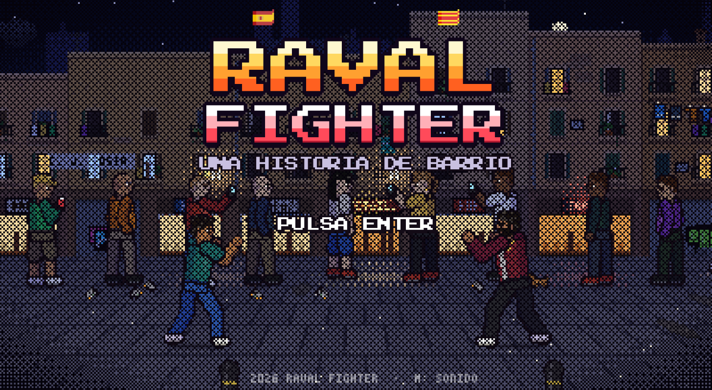
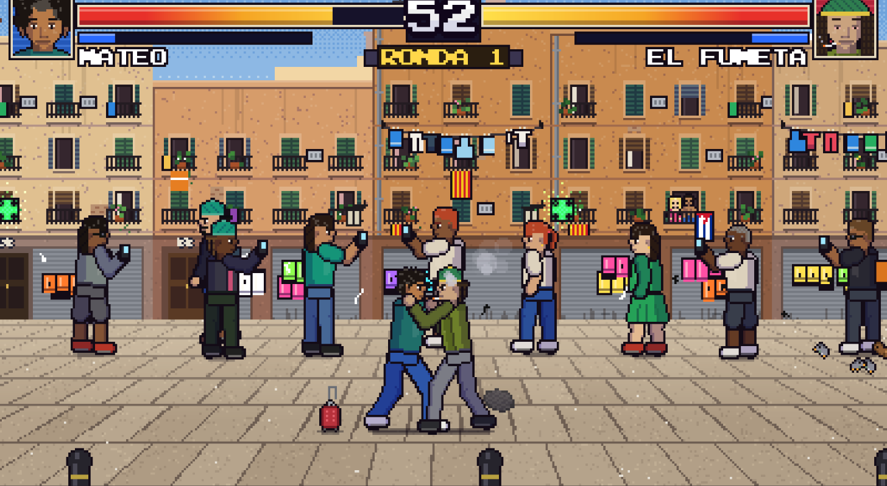
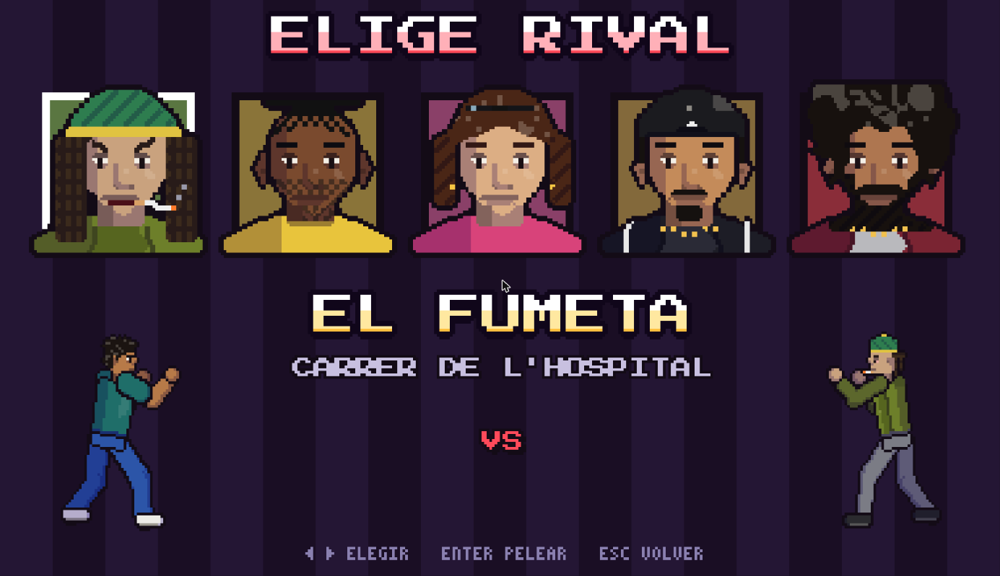

<h1 align="center">RAVAL FIGHTER</h1>

<p align="center"><b>Una historia de barrio.</b> Juego de lucha arcade 2D en pixel art ambientado en El Raval, Barcelona.</p>

<p align="center">
  <a href="https://freddysae0.github.io/raval-fighter/"></a>
</p>

<p align="center"></p>

HTML5 Canvas + WebAudio, **sin dependencias**: todo el arte y el sonido se generan por código. Modo historia con 5 combates por el Raval, pelea rápida, tres dificultades, y soporte para teclado, mando y pantalla táctil.

<table>
  <tr>
    <td></td>
    <td></td>
  </tr>
  <tr>
    <td align="center"><sub>Ronda 1 contra El Fumeta, Carrer de l'Hospital</sub></td>
    <td align="center"><sub>Pelea rápida: elige rival</sub></td>
  </tr>
</table>

## Cómo jugar

Juega online en **[freddysae0.github.io/raval-fighter](https://freddysae0.github.io/raval-fighter/)** o en local:

```
python serve.py
```
Abre http://localhost:8765 (también funciona abriendo `index.html` directamente).

| Tecla | Acción |
|---|---|
| ← → | Moverse (hacia atrás = bloquear) |
| ↑ / ↓ | Saltar / agacharse (↓ + atrás = bloqueo bajo) |
| J / Z | Puñetazo (J, J = combo) |
| K / X | Patada (↓ + K = barrido) |
| L / C o ↓↘→ + J | Especial: ¡Chanclazo! |
| I / V | Súper (con la barra azul llena): ¡Furia Latina! |
| Enter / Espacio | Confirmar / pasar diálogo |
| Esc / P | Pausa · saltar escena |
| M | Sonido on/off |

También funciona con mando y con controles táctiles.

## Historia
Eliges tu país → despedida en el aeropuerto (la abuela te da la chancla) → vuelo y la bandera en El Prat → llegada al metro de Liceu → 5 combates por el Raval hasta el Airbnb:

1. **El Fumeta** — Carrer de l'Hospital (tarde) — *"Amigo... ¿tiene cigarro?"*
2. **El Latero** — Rambla del Raval (atardecer) — *"¡Cerveza, beer, un euro!"*
3. **La Carterista** — Plaça dels Àngels / MACBA (anochecer) — *"Oye guapo, ¿me haces una foto?"*
4. **El Relojero** — Carrer de Joaquín Costa (noche) — *"Amigo, amigo... ¿tiene hora?"*
5. **El Brayan** (jefe) — Carrer de la Riera Baixa (lluvia) — *"Amigo... ¿tú de dónde eres?"*

Modo **Pelea rápida** en el menú para elegir rival directamente.

**Dificultad:** Fácil / Medio / Difícil, seleccionable en el menú principal y en el menú de pausa (se aplica al momento y se guarda para la próxima vez).

## Estructura
- `js/core.js` — canvas, utilidades, texto pixel, input (teclado/mando/táctil), efectos
- `js/audio.js` — sintetizador chiptune (pulso/triángulo/ruido), SFX y secuenciador de música
- `js/art.js` — personajes: esqueleto + poses con keyframes rasterizados a pixel art, caras, retratos (Scale2x)
- `js/world.js` — escenarios procedurales con parallax, suelo en perspectiva, público, palomas, lluvia
- `js/fight.js` — luchadores, frame data, IA, proyectiles, HUD
- `js/story.js` — escenas, diálogos y flujo de la historia
- `js/main.js` — bucle principal (60 Hz fijo). Atajos dev: `#airport`, `#flight`, `#arrival`, `#stage=0..4`, `#fight=0..4`, `#ending`, `#quick`
